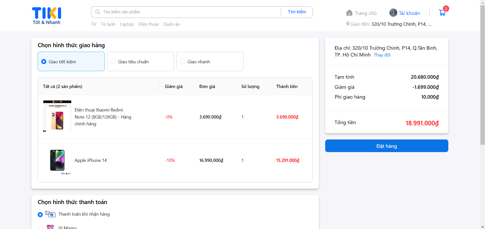
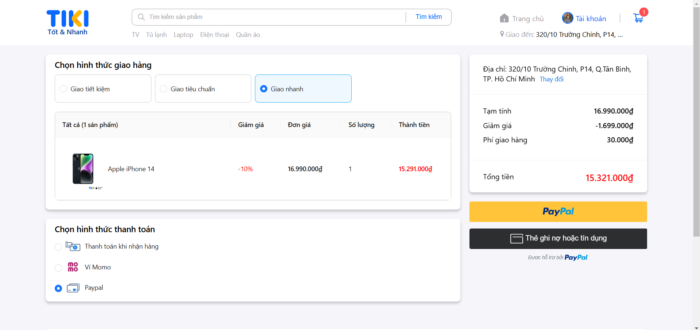
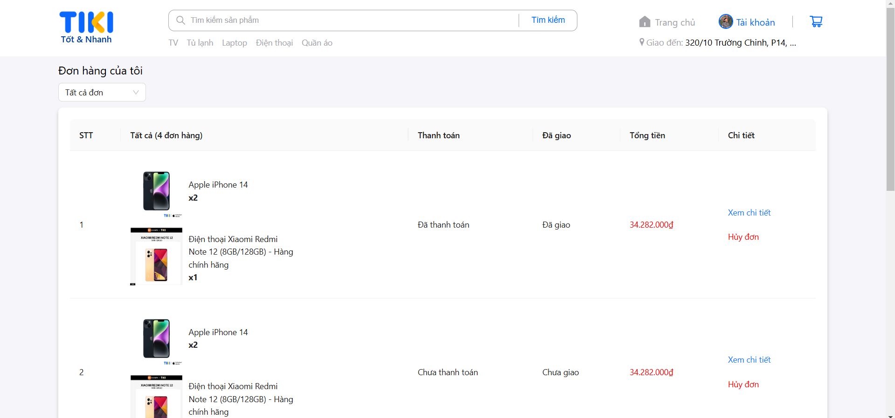
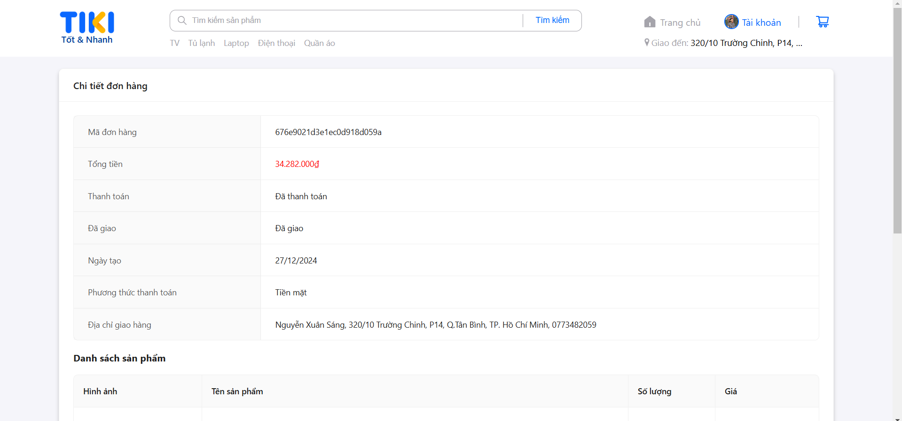
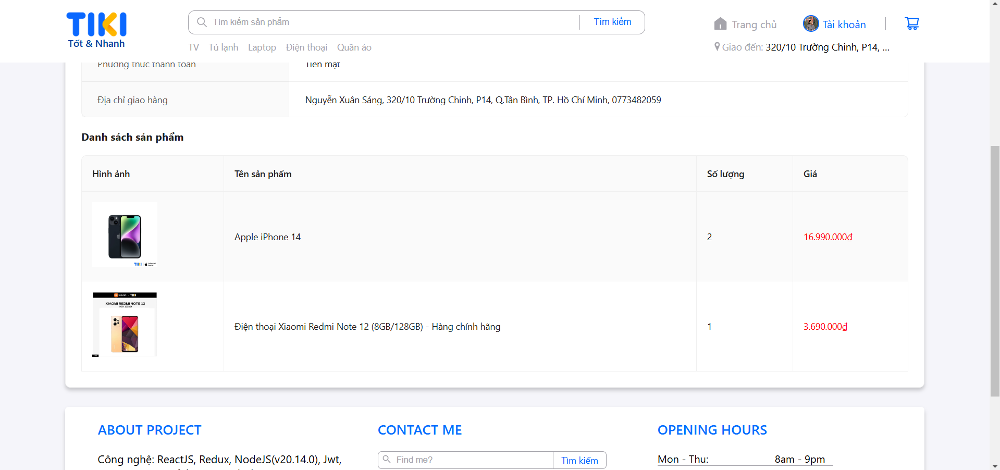

Công nghệ: ReactJS, Redux, NodeJS(v20.14.0), Jwt, MongoDB, RESTful API, Ant design

Đang hoàn thiện quản lý đơn hàng phía admin

Trang chủ:

Lọc theo danh mục:

Tìm kiếm SP:

Chi tiết SP:

Đăng nhập:

Đăng ký:

Thông tin người dùng:

Giỏ hàng:

Đặt hàng:

Thanh toán Paypal:

Quản lý đơn hàng:

Chi tiết đơn hàng:

Trang quản lý sản phẩm:

Chi tiết SP:

Thêm SP:

Quản lý người dùng:

Chi tiết người dùng:

Thêm người dùng:

